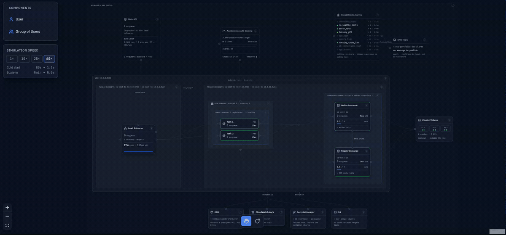

<!-- Idiomas: **Português** · English (em breve) -->

# infra-terraform-aws

Este repositório tem a infraestrutura completa, em código, de uma aplicação web de empresa de médio a grande porte na AWS. São oito módulos Terraform cobrindo rede, computação, banco, borda de segurança, observabilidade e o próprio CI/CD que aplica tudo isso, dimensionados para tráfego de produção: carga alta constante e picos que exigem capacidade nova em poucos minutos.

---

<em>Infraestrutura simulada sob carga. <a href="https://orionth1.github.io/infra-simulator-aws/">Abrir o simulador</a></em>

## A arquitetura

Tracejado marca serviço regional da AWS, fora da sua VPC. As subnets privadas não têm rota para internet: tudo que sai delas passa por um VPC endpoint.

## O que tem aqui

O tráfego entra pelo WAF, o Application Load Balancer distribui entre as tasks do ECS Fargate, e a consulta termina no Aurora. Nada disso alcança a internet: as tasks e o banco ficam em subnets privadas sem rota de saída, e o que precisa falar com a AWS sai por VPC endpoint.

- **ECS Fargate** com 2 a 10 tasks. O autoscaling reage a requisições por target, não a CPU, então capacidade nova entra quando o volume sobe. No teto, o serviço absorve aproximadamente 10.000 req/min.
- **Aurora Serverless v2** com duas instâncias, writer e reader, espalhadas por duas zonas de disponibilidade. A faixa vai de 0,5 a 4 ACU por instância, e a senha é gerada e rotacionada pelo próprio RDS.
- **Rede** em 2 AZs, com 4 interface endpoints e 1 gateway endpoint no lugar de um NAT Gateway.
- **WAF** com rate limit de 2.000 requisições por IP a cada 5 minutos e 4 grupos de regras gerenciadas da AWS.
- **IAM e segredos** sob menor privilégio em cada camada: security group que aceita o tier anterior pela referência do grupo e nunca por CIDR, execution role separada da task role, e senha de banco que nunca aparece em variável nem em state.
- **Observabilidade** com 9 alarmes CloudWatch num único tópico SNS, dashboard, metric filter de erros da aplicação e 2 regras do EventBridge para falha de deploy.
- **CI/CD** em 3 workflows autenticados por OIDC, sem chave estática, cada um com sua própria role. O plan é comentado no PR, o apply exige aprovação manual, e o deploy de imagem corre à parte. Checkov e Trivy quebram o build e publicam SARIF.

## Onde ir agora

| | |
|---|---|
| [**`infra/`**](infra/README.md) | O Terraform: mapa dos módulos, as decisões de arquitetura e o porquê de cada uma, setup do remote state e o roteiro de validação end-to-end |
| [**`backend/`**](backend/README.md) | A aplicação Express que as tasks rodam, e o contrato invisível entre ela e a infraestrutura |
| [**infra-simulator-aws**](https://github.com/OrionTH1/infra-simulator-aws) | O simulador do GIF acima: como ele modela esta infra e de onde vem cada número que ele mostra |
