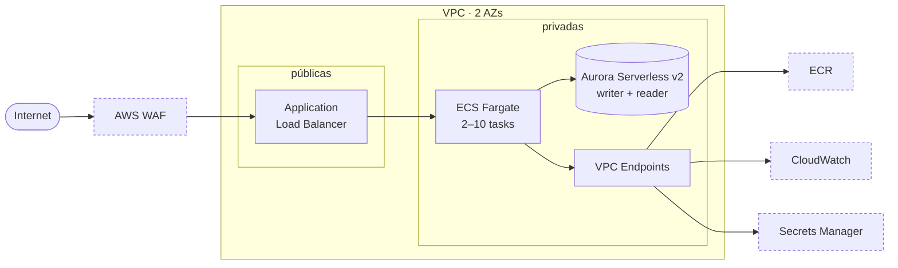

<!-- Idiomas: **Português** · English (em breve) -->

# infra-terraform-aws

Infraestrutura AWS em Terraform para um serviço web dimensionado como produção: subnets privadas sem rota para internet, ECS Fargate atrás de um Application Load Balancer, Aurora Serverless v2, WAF, observabilidade e CI/CD por OIDC.

A aplicação é deliberadamente trivial — um endpoint de health check que serve de canário. Toda a engenharia está na infraestrutura e em como ela é comunicada.

---

<em>A mesma infraestrutura, sob carga — <a href="https://orionth1.github.io/infra-simulator-aws/">abrir o simulador</a></em>

## A arquitetura

Tracejado: serviço regional da AWS, fora da sua VPC. As subnets privadas não têm rota para internet — tudo que sai delas passa por um VPC endpoint.

## O que tem aqui

- **ECS Fargate** — 2 a 10 tasks, autoscaling por requisições por target, teto de ~10.000 req/min
- **Aurora Serverless v2** — writer e reader em AZs diferentes, 0,5 a 4 ACU, senha gerada e rotacionada pelo RDS
- **Rede** — 2 AZs, subnets privadas sem rota para internet, 4 interface endpoints e 1 gateway endpoint, zero NAT
- **WAF** — rate limit de 2.000 req/5min por IP e 4 grupos de regras gerenciadas da AWS
- **Observabilidade** — 9 alarmes CloudWatch num único tópico SNS, dashboard, metric filter de erros e 2 regras EventBridge
- **CI/CD** — 3 workflows com OIDC, sem chave estática: plan comentado no PR, apply com aprovação manual, deploy de imagem à parte
- **Segurança no CI** — Checkov no IaC e Trivy na imagem, ambos falhando o build e publicando SARIF

## Onde ir agora

| | |
|---|---|
| [**`infra/`**](infra/README.md) | O Terraform: mapa dos módulos, as decisões de arquitetura e o porquê de cada uma, setup do remote state e o roteiro de validação end-to-end |
| [**`backend/`**](backend/README.md) | A aplicação Express que as tasks rodam, e por que ela é intencionalmente mínima |
| [**infra-simulator-aws**](https://github.com/OrionTH1/infra-simulator-aws) | O simulador do GIF acima: como ele modela esta infra e de onde vem cada número que ele mostra |
